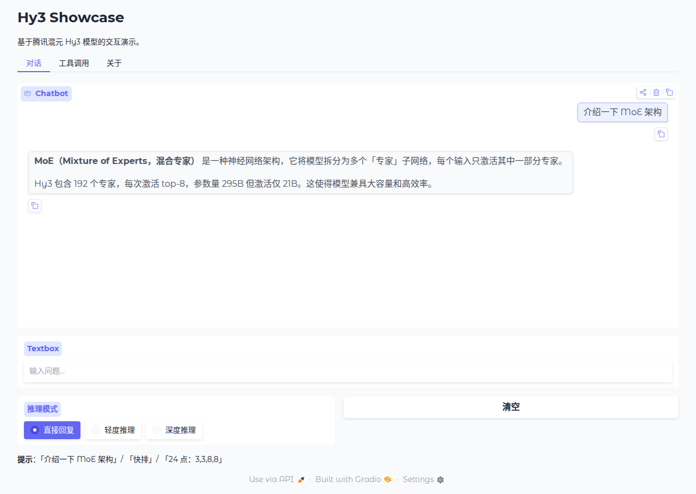
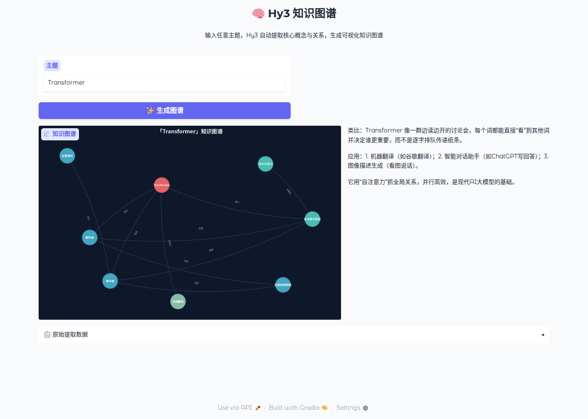

# Hy3 Showcase

基于腾讯混元 **Hy3** 模型的交互演示项目。Hy3 是快慢思考融合 MoE，295B 参数 / 21B 激活 / 256K 上下文。

## 快速开始

```bash
pip install -r requirements.txt
python cli.py "介绍一下 MoE 架构"
```

无需 API Key 即可运行（自动降级 Mock 模式），输出：

```
Hy3 CLI (Mock)  http://localhost:8000/v1  hy3

**MoE（Mixture of Experts，混合专家）** 是一种神经网络架构，
它将模型拆分为多个「专家」子网络，每个输入只激活其中一部分专家。
```

## 使用方式

四种组合覆盖所有场景：

| 界面 | Mock（无需 Key） | 真实 API（需 Key） |
|------|-----------------|-------------------|
| CLI | `python cli.py "你好"` | `HY3_API_KEY=sk-xxx python cli.py` |
| Web | `python app.py` | `HY3_API_KEY=sk-xxx python app.py` |
| 知识图谱 | `python kg.py` | `HY3_API_KEY=sk-xxx python kg.py` |

### CLI 命令行

```bash
python cli.py "快排"
python cli.py --stream "设计分布式缓存"
python cli.py --reasoning high "24点：3,3,8,8"
python cli.py  # 交互模式
```

### Web 界面

```bash
python app.py
# 浏览器打开 http://localhost:7860
```

三个标签页：对话（支持三级推理切换）、工具调用（计算器 Agent）、关于（当前模式）。

### 🧠 知识图谱（创意应用）

```bash
python kg.py
# 浏览器打开 http://localhost:7861
```

输入任意主题（如 Transformer、注意力机制），Hy3 自动提取核心概念与关系，生成可视化知识图谱和通俗解释。

## 项目结构

```
hy3-showcase/
├── hy3_showcase/
│   ├── client.py       Hy3Client
│   ├── config.py       环境变量配置
│   └── mock.py         Mock 响应数据
├── app.py              Web 界面
├── cli.py              命令行
├── kg.py               知识图谱创意应用
├── run/                演示脚本
│   ├── cli-mock.py     CLI + Mock
│   ├── cli-e2e.py      CLI + 真实 API
│   ├── app-mock.py     Web + Mock 截图
│   ├── app-e2e.py      Web + 真实 API 截图
│   └── kg-e2e.py        知识图谱截图
├── tests/              测试
│   ├── test-mock.py    8 项 Mock 测试
│   ├── test-e2e.py     4 项端到端测试
│   ├── test-cli.py     CLI 冒烟
│   ├── test-app.py     Web 集成测试
│   └── test-kg.py      知识图谱单元测试
├── demo/               运行输出
│   ├── cli-mock.txt    CLI + Mock 对话实录
│   ├── cli-e2e.txt     CLI + 真实 API 对话实录
│   └── app-mock-*.png  Web + Mock 截图
├── requirements.txt
└── .env.example
```

## 演示与测试

### 运行演示（输出存 demo/ 目录）

```bash
# CLI + Mock
python run/cli-mock.py

# CLI + 真实 API（需设置环境变量）
export HY3_API_BASE="https://tokenhub.tencentmaas.com/v1"
export HY3_API_KEY=sk-xxxx
python run/cli-e2e.py

# Web + Mock 截图
HY3_MOCK=true python app.py & # 先启动 app
python run/app-mock.py

# Web + 真实 API 截图（需设置环境变量）
export HY3_API_BASE="https://tokenhub.tencentmaas.com/v1"
export HY3_API_KEY=sk-xxxx
python app.py & # 先启动 app
python run/app-e2e.py

# 知识图谱真实 API 截图
export HY3_API_BASE="https://tokenhub.tencentmaas.com/v1"
export HY3_API_KEY=sk-xxxx
python kg.py & # 先启动 kg
python run/kg-e2e.py
```

### 运行测试

```bash
# 全部（忽略 e2e）
pytest tests/ --ignore=tests/test-e2e.py --ignore=tests/kg-e2e.py -v

# 按类别
pytest tests/test-mock.py -v      # Mock 模式（无需 Key）
pytest tests/test-cli.py -v       # CLI 冒烟（Mock）
pytest tests/test-kg.py -v        # 知识图谱单元测试（无需 Key）
pytest tests/test-app.py -v       # Web 集成（需 Playwright）

# 端到端测试（需设置 HY3_API_KEY）
pytest tests/test-e2e.py -v       # API 基础 + 知识图谱提取/解释
```

### 演示输出预览

`demo/cli-mock.txt`
```
=== Hy3 CLI + Mock ===

--- 1. 基础对话 ---
  > 你好
  < 你好！我是 Hy3，有什么可以帮助你的吗？
  ✓ PASS  非流式返回

--- 5. 深度推理 ---
  > 24点：3,3,8,8
  < 8 ÷ (3 - 8 ÷ 3) = 24 ✅
  ✓ PASS  含 24

=== 结果: 7/7 通过, 0 失败 ===
```

`demo/cli-e2e.txt`（真实 API 含完整代码输出）
```
=== Hy3 CLI + 真实 API ===

--- 2. 流式输出 ---
  > 用 Python 写一个快排
  < 121 chunks, 693 字
  ────────────────────────────────────────
  下面是一个用 Python 实现的快速排序（Quick Sort）示例...
  ────────────────────────────────────────
```

`demo/screenshots/app-mock-chat.png`


`demo/screnshots/kg-graph.png`


## 环境变量

| 变量 | 默认值 | 说明 |
|------|--------|------|
| `HY3_API_BASE` | `http://localhost:8000/v1` | API 端点 |
| `HY3_API_KEY` | `""` | 密钥（留空 = Mock） |
| `HY3_MODEL` | `hy3` | 模型名 |
| `HY3_MOCK` | `false` | 强制 Mock |

## 相关项目

- [Tencent-Hunyuan/Hy3](https://github.com/Tencent-Hunyuan/Hy3) — 官方仓库
- [docs/integrations/](https://github.com/Tencent-Hunyuan/Hy3/tree/rhinobird2026/docs/integrations) — OpenRouter / Cursor / Cline / CodeBuddy / Dify 集成指南

## License

Apache 2.0
